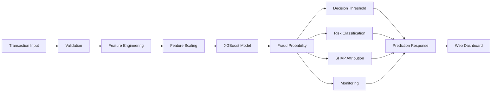

<div align="center">

# 🛡️ FraudShield AI

### Real-Time Financial Fraud Detection with Explainable Machine Learning

A portfolio-focused fraud detection platform combining **XGBoost**, **FastAPI**, real-time **SHAP explainability**, risk classification, batch prediction, monitoring, and a responsive web dashboard.

Trained on **6.36M PaySim transactions** using **pre-transaction features** and evaluated with a **time-aware train/validation/test strategy**.

<p>


</p>

**⚡ Real-Time Scoring · SHAP Explainability · Risk Classification · Batch Prediction · Monitoring · API Security**

</div>

---

## 🌐 Live Demo

| Service              | Link                                               |
| -------------------- | -------------------------------------------------- |
| 🚀 Frontend          | https://fraud-detection-api-eta.vercel.app         |
| ⚙️ Backend API       | https://fraud-detection-api-w9hz.onrender.com      |
| 📚 Swagger / OpenAPI | https://fraud-detection-api-w9hz.onrender.com/docs |

> **Note:** The backend is hosted on Render's free tier and may require around **30–50 seconds to wake after inactivity**. Subsequent requests are typically faster.

---

## 🧠 What FraudShield AI Does

FraudShield AI analyzes a financial transaction **before approval** and returns:

* Fraud probability
* Fraud / legitimate decision
* Risk level
* Decision threshold
* Human-readable investigation summary
* Rule-based risk indicators
* Per-prediction SHAP attribution
* Model version
* Inference latency

The system is designed around an important constraint:

> **Only information available before a transaction is approved should be used for prediction.**

This means post-transaction fields such as `newbalanceOrig` and `newbalanceDest` are deliberately excluded from the prediction pipeline.

---

## ✨ Core Features

| Capability               | Implementation                                      |
| ------------------------ | --------------------------------------------------- |
| 🧠 Fraud Detection       | XGBoost classifier                                  |
| ⚡ API                    | FastAPI + Uvicorn                                   |
| 🔎 Explainability        | Native XGBoost SHAP contributions                   |
| 🚦 Risk Engine           | LOW / MEDIUM / HIGH / CRITICAL                      |
| 📦 Batch Prediction      | Up to 500 transactions/request                      |
| 📊 Model Analytics       | ROC, PR, confusion matrix, feature importance       |
| 📈 Runtime Monitoring    | Prediction volume, fraud rate, latency, score drift |
| 🛡️ Rate Limiting        | 30/min `/predict`, 10/min `/predict/batch`          |
| 🔐 API Security          | Optional `X-API-Key` authentication                 |
| 🌍 CORS                  | Configurable allowed origins                        |
| 📚 API Documentation     | Swagger / OpenAPI                                   |
| 🧬 Model Versioning      | SHA-256 content hash                                |
| 🔄 Training Traceability | Model registry + metrics JSON                       |
| ✅ Automated Testing      | Pytest                                              |
| 🧹 Code Quality          | Flake8                                              |
| 🔁 CI                    | GitHub Actions                                      |
| 🐳 Containerization      | Docker-ready                                        |
| 🌐 Deployment            | Vercel + Render                                     |

---

## 🏗️ Architecture



### Deployment Architecture

```text
                     ┌─────────────────────┐
                     │     User Browser    │
                     └──────────┬──────────┘
                                │ HTTPS
                                ▼
                     ┌─────────────────────┐
                     │  Vercel Frontend    │
                     │ HTML / CSS / JS     │
                     └──────────┬──────────┘
                                │ JSON
                                ▼
                     ┌─────────────────────┐
                     │   Render Backend    │
                     │      FastAPI        │
                     └──────────┬──────────┘
                                │
                ┌───────────────┼───────────────┐
                ▼               ▼               ▼
        Feature Engineering   XGBoost       Monitoring
                │               │               │
                └───────────────┼───────────────┘
                                ▼
                     ┌─────────────────────┐
                     │ Prediction Response │
                     └─────────────────────┘
```

---

## 📊 Model Performance

The latest committed training run is evaluated on a **held-out time-aware test set**, with the fraud decision threshold selected using a separate validation set.

| Metric                      |      Result |
| --------------------------- | ----------: |
| **ROC-AUC**                 | **0.99981** |
| **PR-AUC**                  | **0.99717** |
| **Precision — Fraud Class** |  **99.49%** |
| **Recall — Fraud Class**    |  **95.93%** |
| **F1 — Fraud Class**        | **0.97678** |
| **Accuracy**                | **99.985%** |
| **Decision Threshold**      | **0.99126** |
| **Features**                |      **10** |

### Dataset / Split Breakdown

The source dataset contains **6,362,620 transactions**.

| Dataset Portion           |          Rows |
| ------------------------- | ------------: |
| Original training split   | **4,581,086** |
| Validation split          |   **509,010** |
| Held-out test split       | **1,272,524** |
| **Total**                 | **6,362,620** |
| Training rows after SMOTE | **5,035,134** |

> The `5,035,134` figure is the training size **after SMOTE oversampling**. Validation and test sets are not oversampled.

### Held-Out Test Confusion Matrix

```text
                     Predicted
                  Legit       Fraud
Actual Legit    1,268,249       21
Actual Fraud          173    4,081
```

This corresponds to:

* **True Negatives:** 1,268,249
* **False Positives:** 21
* **False Negatives:** 173
* **True Positives:** 4,081

---

## ⚠️ Interpreting the Model Results

These results are **PaySim benchmark results**, not evidence of equivalent performance on real banking data.

PaySim is a **synthetic financial transaction dataset**, and its fraud-generation process can contain simulator-specific patterns that do not generalize directly to real financial systems.

The latest model also shows a strong dependence on `would_drain_orig`, which contributes roughly **58% of total feature importance**.

That feature is computed entirely from:

```text
oldbalanceOrg
+
amount
```

so it is available before approval, but its strong influence is still worth scrutiny because balance-related variables in PaySim can reflect simulator artifacts.

For this reason, the project deliberately treats the reported metrics as a **dataset benchmark** rather than a production accuracy claim.

---

## 🔬 Evaluation Methodology

A standard random train/test split can be misleading for this problem because several model inputs are temporal.

Two features are derived from transaction history:

```text
recency_hours
txn_count_24h
```

These depend on chronological activity for the sender.

### Time-Aware Evaluation

The default training strategy is:

```text
SPLIT_STRATEGY=time
```

The dataset is sorted by PaySim's `step` field and the most recent 20% is held out as the test set.

Conceptually:

```text
Earlier transactions
        │
        ▼
┌───────────────────────────────┐
│ Training + Validation         │
└───────────────────────────────┘
                │
                ▼
        Later transactions
                │
                ▼
┌───────────────────────────────┐
│ Held-Out Test Set             │
└───────────────────────────────┘
```

This better reflects deployment, where a model is trained on past data and predicts future transactions.

A random stratified split remains available for comparison:

```text
SPLIT_STRATEGY=random
```

but the time-aware strategy is the default.

---

## 🎯 Threshold Selection

The model does not simply use the default probability threshold of `0.5`.

The latest run selected:

```text
F1 threshold = 0.99126
```

### Why a Separate Validation Set?

The threshold is selected on the validation split rather than the final test set.

```text
Training data
     │
     ├── Model fitting
     │
     └── Validation
            │
            └── Threshold selection
                         │
                         ▼
                    Final test
```

The test set is then evaluated using the already-fixed threshold.

This prevents the threshold from being optimized directly against the final reported test results.

---

## 💵 Business-Cost Threshold

The training pipeline also computes an alternative threshold based on simulated business costs.

Default assumptions:

```text
False Positive Cost = 5
False Negative Cost = 100
```

Latest computed cost threshold:

```text
0.93
```

These costs are **illustrative assumptions only**.

They are not calibrated against real fraud losses, investigation costs, or banking operations.

The cost-based threshold can be enabled explicitly:

```text
THRESHOLD_STRATEGY=cost
```

The default remains:

```text
THRESHOLD_STRATEGY=f1
```

---

## 🧩 Feature Engineering

The model uses **10 engineered features**:

| Feature                | Description                                                        |
| ---------------------- | ------------------------------------------------------------------ |
| `type_enc`             | Encoded transaction type                                           |
| `log_amount`           | Log-transformed transaction amount                                 |
| `log_oldbalanceOrg`    | Log-transformed sender balance                                     |
| `log_oldbalanceDest`   | Log-transformed destination balance                                |
| `amount_ratio_orig`    | Transaction amount relative to sender balance                      |
| `would_drain_orig`     | Whether the requested transaction would exhaust the sender balance |
| `dest_balance_anomaly` | Whether destination balance was zero                               |
| `is_dest_new`          | Whether the destination is newly observed                          |
| `recency_hours`        | Time since sender's previous transaction                           |
| `txn_count_24h`        | Sender transactions during the previous 24 hours                   |

### Deliberately Excluded Fields

The model does **not** use:

```text
newbalanceOrig
newbalanceDest
```

because they represent post-transaction state and can introduce direct or indirect label leakage in this dataset.

---

## 🕒 Velocity Features

The training pipeline derives temporal features from the chronological PaySim event log.

### `recency_hours`

Hours since the sender's previous transaction.

For a sender with no previous transaction, the implementation uses a dormant/new-sender value of:

```text
720 hours
```

### `txn_count_24h`

Number of the sender's other transactions during the trailing 24-hour window.

The current transaction itself is excluded from the count.

### `is_dest_new`

Indicates whether the destination account has been seen previously in the chronological transaction stream.

---

## 🤖 Machine Learning Pipeline

The training process is:

```text
PaySim Dataset
      │
      ▼
Temporal Feature Derivation
      │
      ▼
Feature Engineering
      │
      ▼
Time-Aware Split
      │
      ├───────────────┐
      ▼               ▼
 Training          Validation
      │               │
      ▼               │
 StandardScaler       │
      │               │
      ▼               │
     SMOTE             │
      │               │
      ▼               │
   XGBoost ◄──────────┘
      │
      ▼
Threshold Selection
      │
      ▼
Held-Out Test Evaluation
      │
      ├── Metrics
      ├── Confusion Matrix
      ├── ROC Curve
      ├── PR Curve
      └── Feature Importance
```

### XGBoost Configuration

The latest training pipeline uses:

```text
n_estimators = 500
max_depth = 6
learning_rate = 0.05
subsample = 0.8
colsample_bytree = 0.8
eval_metric = aucpr
tree_method = hist
random_state = 42
```

SMOTE is applied only to the training data with:

```text
sampling_strategy = 0.10
```

---

## 🧠 Explainable AI with SHAP

FraudShield AI provides **per-prediction model attribution** using XGBoost's native SHAP contribution support.

The API returns fields such as:

```json
{
  "feature": "would_drain_orig",
  "label": "Transaction would fully drain sender's account",
  "shap_value": 3.2412,
  "direction": "increases risk"
}
```

Each prediction can expose the features that contributed most strongly to that specific decision.

This is separate from the deterministic rule-based indicators displayed by the application.

### Two Explanation Layers

```text
Prediction
   │
   ├── Rule-Based Indicators
   │      └── Fast deterministic sanity checks
   │
   └── SHAP Attribution
          └── Model-specific contribution
```

---

## 🚦 Risk Classification

Risk level and binary fraud decision are separate concepts.

### Risk Levels

```text
< 0.30        → LOW
0.30–0.59     → MEDIUM
0.60–0.84     → HIGH
≥ 0.85        → CRITICAL
```

### Fraud Decision

The binary decision currently uses the learned threshold:

```text
fraud_probability >= 0.99126
          │
          ├── True  → Fraud
          └── False → Not flagged
```

This means a transaction can have an elevated risk level while still remaining below the automatic fraud flagging threshold.

---

## 🔌 REST API

### Endpoints

| Method | Endpoint               | Purpose                                       |
| ------ | ---------------------- | --------------------------------------------- |
| `GET`  | `/`                    | Redirects to Swagger docs                     |
| `GET`  | `/health`              | Service health and uptime                     |
| `GET`  | `/model/info`          | Model metadata, metrics, registry information |
| `GET`  | `/metrics/predictions` | Runtime monitoring                            |
| `POST` | `/predict`             | Single transaction prediction                 |
| `POST` | `/predict/batch`       | Batch transaction prediction                  |

---

## 📥 Prediction Input

The API accepts:

```json
{
  "type": "TRANSFER",
  "amount": 800000,
  "oldbalanceOrg": 800000,
  "oldbalanceDest": 0,
  "recency_hours": 24,
  "txn_count_24h": 1,
  "is_dest_new": 1
}
```

### Supported Transaction Types

```text
PAYMENT
TRANSFER
CASH_OUT
DEBIT
CASH_IN
```

Invalid transaction types are rejected rather than silently mapped to a default class.

---

## 📤 Prediction Response

A typical response contains:

```json
{
  "fraud_probability": 0.9997,
  "confidence": "99.97%",
  "threshold": "99%",
  "is_fraud": true,
  "risk_level": "CRITICAL",
  "model": "XGBoost Fraud Classifier v1.0",
  "model_version": "<model-hash>",
  "top_risk_factors": [
    "Large transaction amount",
    "High-risk transaction type (TRANSFER)",
    "Transaction would fully drain sender account"
  ],
  "shap_top_factors": [
    {
      "feature": "would_drain_orig",
      "label": "Transaction would fully drain sender's account",
      "shap_value": 3.24,
      "direction": "increases risk"
    }
  ],
  "summary": "Human-readable investigation summary",
  "inference_ms": 8.42
}
```

> The values above illustrate the response structure; prediction probability and latency vary by transaction and runtime conditions.

---

## 📦 Batch Prediction

The API supports:

```text
POST /predict/batch
```

Maximum batch size:

```text
500 transactions
```

A malformed transaction inside a batch is handled as an `UNKNOWN` result rather than automatically failing the entire batch response.

---

## 🛡️ API Protection

### Rate Limiting

```text
/predict
30 requests/minute

/predict/batch
10 requests/minute

Other endpoints
120 requests/minute default
```

Rate limiting is keyed by client IP.

### Optional API Key

Set:

```text
API_KEY=your-secret-key
```

and send:

```text
X-API-Key: your-secret-key
```

The public demo keeps API-key authentication disabled so visitors can test the application without credentials.

### CORS

The API supports configured allowed origins through:

```text
ALLOWED_ORIGINS
```

with comma-separated values.

---

## 📈 Runtime Monitoring

FraudShield AI exposes:

```text
GET /metrics/predictions
```

The monitoring layer tracks:

* Total predictions
* Fraud-flagged predictions
* Fraud rate
* Mean latency
* P50 latency
* P95 latency
* P99 latency
* Fraud-probability mean
* Fraud-probability standard deviation
* Predictions by model version

Each prediction is tagged with the model version that produced it.

### Monitoring Scope

The current implementation uses:

```text
In-memory aggregates
+
Local JSONL logging
```

These are appropriate for a portfolio/demo deployment, but they are **not persistent production monitoring infrastructure**.

Render restarts/redeployments can reset this information.

A production deployment would typically send metrics and logs to durable infrastructure such as Prometheus, CloudWatch, a database, or an external log/observability platform.

---

## 🧬 Model Versioning

Each trained model receives a short SHA-256 content hash based on the saved XGBoost model file.

Example:

```text
ba2017f97593
```

This version is returned by the prediction API:

```json
{
  "model_version": "ba2017f97593"
}
```

The repository also maintains:

```text
models/model_registry.jsonl
```

which records training-run metadata including:

* Model version
* Training timestamp
* ROC-AUC
* PR-AUC
* Selected threshold
* F1 threshold
* Cost threshold
* Split strategy
* Training size
* Validation size
* Test size

This makes it possible to trace predictions back to the model artifact that produced them.

---

## 📊 Model Insights Dashboard

The frontend includes a dedicated **Model Insights** view powered by `/model/info`.

It displays live training analytics including:

* ROC-AUC
* PR-AUC
* Precision
* Recall
* F1
* Accuracy
* Feature count
* Decision threshold
* Confusion matrix
* Feature importance
* ROC curve
* Precision-Recall curve

The plotted analytics come from the committed training metrics rather than manually entered dashboard values.

---

## 📸 Screenshots

### Dashboard

<p align="center">

</p>

### Fraud Detection

<p align="center">

</p>

### Legitimate Transaction

<p align="center">

</p>

### Model Insights

<p align="center">

</p>

### API Documentation

<p align="center">

</p>

### About

<p align="center">

</p>

---

## 🛠️ Tech Stack

| Layer               | Technology                        |
| ------------------- | --------------------------------- |
| Language            | Python                            |
| ML Model            | XGBoost                           |
| Data Processing     | Pandas, NumPy                     |
| Feature Scaling     | Scikit-Learn                      |
| Imbalance Handling  | imbalanced-learn / SMOTE          |
| API Framework       | FastAPI                           |
| Validation          | Pydantic                          |
| Server              | Uvicorn                           |
| Explainability      | XGBoost native SHAP contributions |
| Rate Limiting       | SlowAPI                           |
| Frontend            | HTML, CSS, JavaScript             |
| Testing             | Pytest                            |
| Linting             | Flake8                            |
| CI                  | GitHub Actions                    |
| Containerization    | Docker                            |
| Frontend Deployment | Vercel                            |
| Backend Deployment  | Render                            |
| Dataset             | PaySim                            |

---

## 📂 Project Structure

```text
FraudShield-AI/
│
├── .github/
│   └── workflows/
│       └── ci.yml
│
├── api/
│   └── app.py
│
├── frontend/
│   ├── index.html
│   └── avatar.jpg
│
├── models/
│   ├── __init__.py
│   ├── train.py
│   ├── main.py
│   ├── features.py
│   ├── monitoring.py
│   ├── metrics.json
│   ├── model_registry.jsonl
│   ├── feature_importance.csv
│   ├── feature_names.pkl
│   ├── scaler.pkl
│   ├── threshold.pkl
│   └── xgb_fraud.json
│
├── scripts/
│   ├── diagnose_velocity_features.py
│   └── verify_would_drain_orig.py
│
├── screenshots/
│   ├── about.png
│   ├── api-docs.png
│   ├── developer-photo.jpeg
│   ├── developer.png
│   ├── fraud.png
│   ├── home.png
│   ├── insights.png
│   └── legitimate.png
│
├── tests/
│   ├── conftest.py
│   ├── test_api.py
│   ├── test_features.py
│   ├── test_monitoring.py
│   └── test_train.py
│
├── .dockerignore
├── .flake8
├── .gitignore
├── Dockerfile
├── requirements.txt
├── requirements-dev.txt
├── runtime.txt
└── README.md
```

> `data/` and `logs/` are intentionally excluded from version control through `.gitignore`.

---

## 🚀 Run Locally

### 1. Clone the repository

```bash
git clone https://github.com/Aarya0706/FraudShield-AI.git
cd FraudShield-AI
```

### 2. Create a virtual environment

**Windows**

```bash
python -m venv .venv
.venv\Scripts\activate
```

**Linux / macOS**

```bash
python3 -m venv .venv
source .venv/bin/activate
```

### 3. Install dependencies

```bash
pip install -r requirements.txt
```

For development and testing:

```bash
pip install -r requirements-dev.txt
```

### 4. Start the API

```bash
uvicorn api.app:app --reload
```

Open:

```text
http://127.0.0.1:8000
```

Swagger:

```text
http://127.0.0.1:8000/docs
```

---

## 🧪 Testing

Run the complete test suite:

```bash
pytest tests/ -v
```

The test suite covers:

* Feature generation
* Feature validation
* Leakage-sensitive fields
* Velocity features
* API endpoints
* Prediction response structure
* SHAP attribution
* Batch prediction
* Error handling
* Monitoring
* Rate limiting
* Training helpers
* Threshold-selection logic

---

## 🧹 Linting

Run Flake8:

```bash
flake8 .
```

The repository also runs linting automatically through GitHub Actions.

---

## 🔄 Continuous Integration

GitHub Actions runs on:

```text
push → main
pull request → main
```

The CI workflow performs:

```text
Checkout
   ↓
Python 3.12
   ↓
Install dependencies
   ↓
Flake8
   ↓
Pytest
```

Workflow:

```text
.github/workflows/ci.yml
```

---

## 🐳 Docker

Build the image:

```bash
docker build -t fraudshield-ai .
```

Run it:

```bash
docker run -p 8000:8000 fraudshield-ai
```

Then open:

```text
http://localhost:8000/docs
```

The container uses Python:

```text
3.12.10
```

matching the repository's `runtime.txt`.

---

## 🧪 Training & Retraining

The training pipeline expects the PaySim dataset at:

```text
data/paysim.csv
```

The training script can be executed with:

```bash
python -m models.train
```

It generates or updates:

```text
models/xgb_fraud.json
models/scaler.pkl
models/feature_names.pkl
models/threshold.pkl
models/metrics.json
models/feature_importance.csv
models/model_registry.jsonl
```

### Training Configuration

#### Evaluation split

```text
SPLIT_STRATEGY=time
```

or:

```text
SPLIT_STRATEGY=random
```

Time-aware splitting is the default.

#### Threshold strategy

```text
THRESHOLD_STRATEGY=f1
```

or:

```text
THRESHOLD_STRATEGY=cost
```

F1-based threshold selection is the default.

#### Business-cost assumptions

```text
COST_FALSE_POSITIVE=5
COST_FALSE_NEGATIVE=100
```

These values are intentionally configurable and illustrative.

---

## 🔐 Environment Variables

| Variable              | Purpose                                         | Default  |
| --------------------- | ----------------------------------------------- | -------- |
| `API_KEY`             | Enables API-key authentication when set         | Disabled |
| `ALLOWED_ORIGINS`     | Additional CORS origins                         | Empty    |
| `API_DEBUG`           | Returns raw internal errors for local debugging | `false`  |
| `SPLIT_STRATEGY`      | Training split method                           | `time`   |
| `THRESHOLD_STRATEGY`  | Threshold-selection method                      | `f1`     |
| `COST_FALSE_POSITIVE` | Simulated false-positive cost                   | `5`      |
| `COST_FALSE_NEGATIVE` | Simulated false-negative cost                   | `100`    |

Never commit secrets or `.env` files.

---

## 🧰 Diagnostic Scripts

The repository includes focused diagnostic utilities for investigating model behavior.

### Feature Dominance / Leakage Diagnostic

```bash
python scripts/verify_would_drain_orig.py
```

### Velocity Feature Diagnostic

```bash
python scripts/diagnose_velocity_features.py
```

These scripts help inspect the temporal and balance-related features that have the strongest influence on the current PaySim model.

---

## ⚠️ Known Limitations

FraudShield AI is a **portfolio project**, not a production banking platform.

### Synthetic Data

PaySim is synthetic and may contain artifacts that do not represent real-world financial behavior.

### Feature Dependence

`would_drain_orig` is currently the dominant feature and should be independently validated against real transaction data before production use.

### Monitoring Persistence

Runtime monitoring currently uses in-memory aggregation and local JSONL logging. It does not provide durable cross-restart observability.

### Authentication

API-key authentication is available but disabled on the public demo for usability.

### No Persistent Transaction Store

The current system does not maintain a persistent transaction database or investigation history.

### No RBAC

There is no user authentication or role-based access control yet.

### No Production Fraud Operations Layer

A real banking deployment would require additional systems around:

```text
Case management
Human review
Audit trails
Persistent storage
Model governance
Alert workflows
Drift monitoring
Retraining pipelines
Access control
```

---

## 🗺️ Roadmap

### Completed

* [x] Real-time fraud prediction
* [x] FastAPI backend
* [x] Interactive dashboard
* [x] Vercel deployment
* [x] Render deployment
* [x] XGBoost fraud classifier
* [x] SHAP explainability
* [x] Model version hashing
* [x] Prediction monitoring
* [x] Rate limiting
* [x] Optional API-key authentication
* [x] CORS configuration
* [x] Time-aware evaluation
* [x] Validation-based threshold selection
* [x] Business-cost threshold calculation
* [x] Confusion matrix analytics
* [x] ROC / PR curve analytics
* [x] Automated testing
* [x] GitHub Actions CI

### Planned

* [ ] Persistent transaction history
* [ ] Persistent metrics and logs
* [ ] User authentication / RBAC
* [ ] Fraud investigation workflow
* [ ] Production-grade observability
* [ ] LLM-assisted fraud investigation
* [ ] Enterprise analytics dashboard

---

## 👩‍💻 Developer

<p align="center">

</p>

### Aarya Shirsath

**B.Tech Computer Science Engineering**
**VIT Bhopal University**

<p>

<a href="https://github.com/Aarya0706">

</a>

<a href="https://www.linkedin.com/in/aarya-shirsath-9b7684340/">

</a>

</p>

---

## 📌 Project Highlights

FraudShield AI demonstrates an end-to-end machine learning application rather than only a standalone classifier:

```text
Data
 ↓
Feature Engineering
 ↓
Temporal Evaluation
 ↓
SMOTE + XGBoost
 ↓
Threshold Calibration
 ↓
FastAPI Deployment
 ↓
SHAP Explainability
 ↓
Risk Classification
 ↓
Monitoring
 ↓
Interactive Dashboard
```

The project emphasizes not only model performance, but also **evaluation integrity, explainability, API engineering, testing, deployment, and transparency about dataset limitations**.

---

<div align="center">

⭐ **FraudShield AI — Explainable, API-driven financial fraud detection**

**Built with Python, XGBoost, FastAPI & JavaScript**

Made with ❤️ by **Aarya Shirsath**

</div>
