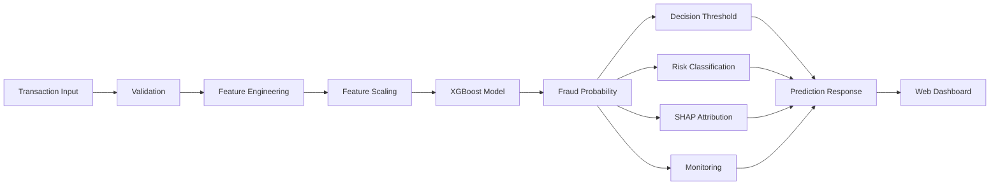

<div align="center">

# 🛡️ FraudShield AI

### Real-Time Financial Fraud Detection with Explainable Machine Learning

A portfolio-focused fraud detection platform combining **XGBoost**, **FastAPI**, real-time **SHAP explainability**, risk classification, batch prediction, monitoring, and a responsive web dashboard.

Trained on **6.36M PaySim transactions** using **pre-transaction features** and evaluated with a **time-aware train/validation/test strategy**.

<p>


</p>

**⚡ Real-Time Scoring · SHAP Explainability · Risk Classification · Batch Prediction · Monitoring · API Security**

</div>

---

## 🌐 Live Demo

| Service              | Link                                               |
| -------------------- | -------------------------------------------------- |
| 🚀 Frontend          | https://fraud-detection-api-eta.vercel.app         |
| ⚙️ Backend API       | https://fraud-detection-api-w9hz.onrender.com      |
| 📚 Swagger / OpenAPI | https://fraud-detection-api-w9hz.onrender.com/docs |

> **Note:** The backend is hosted on Render's free tier and may require around **30–50 seconds to wake after inactivity**. Subsequent requests are typically faster.

---

## 🧠 What FraudShield AI Does

FraudShield AI analyzes a financial transaction **before approval** and returns:

* Fraud probability
* Fraud / legitimate decision
* Risk level
* Decision threshold
* Human-readable investigation summary
* Rule-based risk indicators
* Per-prediction SHAP attribution
* Model version
* Inference latency

The system is designed around an important constraint:

> **Only information available before a transaction is approved should be used for prediction.**

This means post-transaction fields such as `newbalanceOrig` and `newbalanceDest` are deliberately excluded from the prediction pipeline.

---

## ✨ Core Features

| Capability               | Implementation                                      |
| ------------------------ | --------------------------------------------------- |
| 🧠 Fraud Detection       | XGBoost classifier                                  |
| ⚡ API                    | FastAPI + Uvicorn                                   |
| 🔎 Explainability        | Native XGBoost SHAP contributions                   |
| 🚦 Risk Engine           | LOW / MEDIUM / HIGH / CRITICAL                      |
| 📦 Batch Prediction      | Up to 500 transactions/request                      |
| 📊 Model Analytics       | ROC, PR, confusion matrix, feature importance       |
| 📈 Runtime Monitoring    | Prediction volume, fraud rate, latency, score drift |
| 🛡️ Rate Limiting        | 30/min `/predict`, 10/min `/predict/batch`          |
| 🔐 API Security          | Optional `X-API-Key` authentication                 |
| 🌍 CORS                  | Configurable allowed origins                        |
| 📚 API Documentation     | Swagger / OpenAPI                                   |
| 🧬 Model Versioning      | SHA-256 content hash                                |
| 🔄 Training Traceability | Model registry + metrics JSON                       |
| ✅ Automated Testing      | Pytest                                              |
| 🧹 Code Quality          | Flake8                                              |
| 🔁 CI                    | GitHub Actions                                      |
| 🐳 Containerization      | Docker-ready                                        |
| 🌐 Deployment            | Vercel + Render                                     |

---

## 🏗️ Architecture



### Deployment Architecture

```text
                     ┌─────────────────────┐
                     │     User Browser    │
                     └──────────┬──────────┘
                                │ HTTPS
                                ▼
                     ┌─────────────────────┐
                     │  Vercel Frontend    │
                     │ HTML / CSS / JS     │
                     └──────────┬──────────┘
                                │ JSON
                                ▼
                     ┌─────────────────────┐
                     │   Render Backend    │
                     │      FastAPI        │
                     └──────────┬──────────┘
                                │
                ┌───────────────┼───────────────┐
                ▼               ▼               ▼
        Feature Engineering   XGBoost       Monitoring
                │               │               │
                └───────────────┼───────────────┘
                                ▼
                     ┌─────────────────────┐
                     │ Prediction Response │
                     └─────────────────────┘
```

---

## 📊 Model Performance

The latest committed training run is evaluated on a **held-out time-aware test set**, with the fraud decision threshold selected using a separate validation set.

| Metric                      |      Result |
| --------------------------- | ----------: |
| **ROC-AUC**                 | **0.99981** |
| **PR-AUC**                  | **0.99717** |
| **Precision — Fraud Class** |  **99.49%** |
| **Recall — Fraud Class**    |  **95.93%** |
| **F1 — Fraud Class**        | **0.97678** |
| **Accuracy**                | **99.985%** |
| **Decision Threshold**      | **0.99126** |
| **Features**                |      **10** |

### Dataset / Split Breakdown

The source dataset contains **6,362,620 transactions**.

| Dataset Portion           |          Rows |
| ------------------------- | ------------: |
| Original training split   | **4,581,086** |
| Validation split          |   **509,010** |
| Held-out test split       | **1,272,524** |
| **Total**                 | **6,362,620** |
| Training rows after SMOTE | **5,035,134** |

> The `5,035,134` figure is the training size **after SMOTE oversampling**. Validation and test sets are not oversampled.

### Held-Out Test Confusion Matrix

```text
                     Predicted
                  Legit       Fraud
Actual Legit    1,268,249       21
Actual Fraud          173    4,081
```

This corresponds to:

* **True Negatives:** 1,268,249
* **False Positives:** 21
* **False Negatives:** 173
* **True Positives:** 4,081

---

## ⚠️ Interpreting the Model Results

These results are **PaySim benchmark results**, not evidence of equivalent performance on real banking data.

PaySim is a **synthetic financial transaction dataset**, and its fraud-generation process can contain simulator-specific patterns that do not generalize directly to real financial systems.

The latest model also shows a strong dependence on `would_drain_orig`, which contributes roughly **58% of total feature importance**.

That feature is computed entirely from:

```text
oldbalanceOrg
+
amount
```

so it is available before approval, but its strong influence is still worth scrutiny because balance-related variables in PaySim can reflect simulator artifacts.

For this reason, the project deliberately treats the reported metrics as a **dataset benchmark** rather than a production accuracy claim.

---

## 🔬 Evaluation Methodology

A standard random train/test split can be misleading for this problem because several model inputs are temporal.

Two features are derived from transaction history:

```text
recency_hours
txn_count_24h
```

These depend on chronological activity for the sender.

### Time-Aware Evaluation

The default training strategy is:

```text
```
